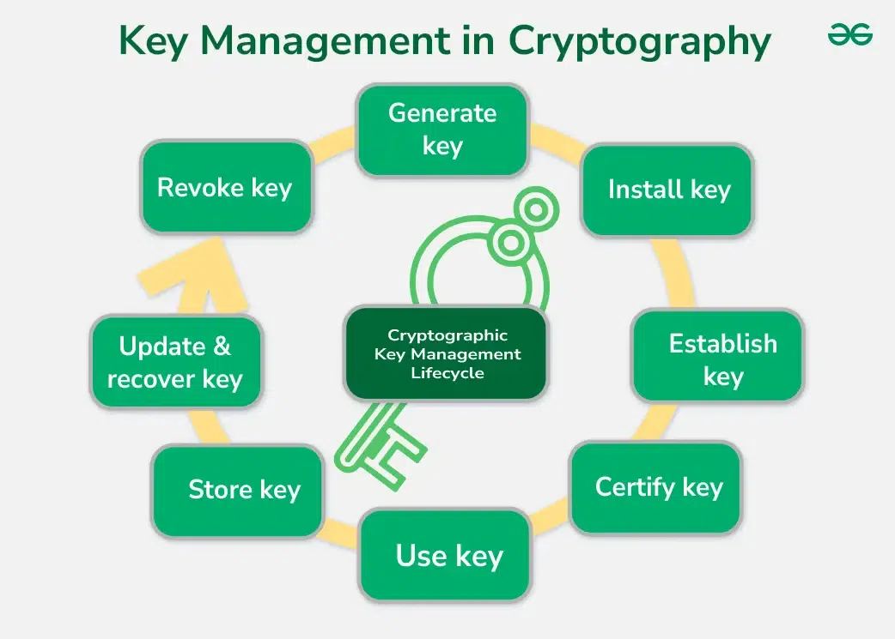
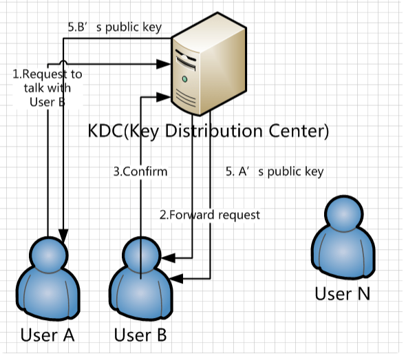

# Key Management and Key Distribution

## Introduction

Encryption is only as secure as the keys used to protect data.

Even the strongest encryption algorithm becomes useless if an attacker obtains the encryption key.

This is why Key Management and Key Distribution are considered among the most important aspects of cryptography.

---



---

# What is a Cryptographic Key?

A cryptographic key is a piece of information used by an encryption algorithm to transform plaintext into ciphertext and vice versa.

### Example

```text
Plaintext
   ↓
Encryption Algorithm
   ↓
Secret Key
   ↓
Ciphertext
```

Without the correct key, encrypted data should be unreadable.

---

# What is Key Management?

Key Management is the process of:

- Generating Keys
- Storing Keys
- Distributing Keys
- Rotating Keys
- Revoking Keys
- Destroying Keys

throughout their lifecycle.

---

# Why Key Management Matters

Consider:

```text
AES-256 = Extremely Secure
```

But:

```text
AES-256 + Stolen Key = Useless
```

An attacker does not need to break AES if they can simply steal the key.

---

# Key Lifecycle

## 1. Key Generation

A cryptographic key is created.

### Requirements

- Randomness
- Unpredictability
- Sufficient Length

---

## 2. Key Distribution

The generated key is securely shared with authorized users.

---

## 3. Key Storage

Keys are stored securely.

Examples:

- Hardware Security Modules (HSM)
- Key Vaults
- Secure Databases

---

## 4. Key Usage

The key is used for:

- Encryption
- Decryption
- Digital Signatures
- Authentication

---

## 5. Key Rotation

Old keys are replaced periodically.

### Benefits

- Reduced Exposure
- Improved Security

---

## 6. Key Revocation

Compromised keys are disabled.

---

## 7. Key Destruction

Keys are permanently removed when no longer needed.

---

# Key Management Challenges

## Key Theft

Attackers attempt to steal encryption keys.

---

## Key Loss

Lost keys can make encrypted data unrecoverable.

---

## Key Distribution

Securely sharing keys is difficult.

---

## Insider Threats

Authorized users may misuse keys.

---

# Key Distribution

## What is Key Distribution?

Key Distribution is the process of securely sharing cryptographic keys between communicating parties.

---

# Why Key Distribution is Difficult

Imagine:

```text
Alice wants to send encrypted data to Bob.
```

Question:

```text
How does Alice securely send the key?
```

If the key is intercepted:

```text
Encryption becomes useless.
```

This problem is known as:

## Key Distribution Problem

---

# Manual Key Distribution

## Process

```text
Alice
   ↓
Physically Gives Key
   ↓
Bob
```

### Advantages

- Simple

### Disadvantages

- Not Scalable
- Difficult for Large Organizations

---

# Public Key Distribution

Used in:

- RSA
- ECC

### Process

```text
Bob Generates

Public Key
Private Key

     ↓

Bob Shares Public Key

     ↓

Alice Encrypts Data

     ↓

Bob Uses Private Key
```

### Advantages

- No Need to Share Secret Keys

### Disadvantages

- Computationally Expensive

---

# Diffie-Hellman Key Exchange

## Purpose

Allows two parties to establish a shared secret key over an insecure network.

---

## Process

```text
Alice
   ↓
Public Value

Bob
   ↓
Public Value

Shared Secret Generated
```

### Advantages

- Secure Key Exchange

### Disadvantages

- Does Not Encrypt Data
- Only Establishes Shared Keys

---

# Key Distribution Center (KDC)

## What is KDC?

A Key Distribution Center (KDC) is a trusted third party responsible for distributing cryptographic keys to users.

Instead of every user sharing keys with every other user:

```text
All Users Trust KDC
```

---



---

# KDC Architecture

```text
          KDC
         / | \
        /  |  \
       /   |   \
   UserA UserB UserC
```

Every user maintains a secure relationship with the KDC.

---

# How KDC Works

## Step 1

User A wants to communicate with User B.

---

## Step 2

User A contacts the KDC.

---

## Step 3

KDC generates a Session Key.

---

## Step 4

KDC securely sends the Session Key.

---

## Step 5

Both users use the Session Key for communication.

---

# Session Keys

## What is a Session Key?

A temporary encryption key used during a communication session.

### Benefits

- Limits Damage
- Improves Security
- Easier Key Rotation

---

# Advantages of KDC

## Centralized Management

Keys are managed from one location.

---

## Scalability

Suitable for large organizations.

---

## Simplified Administration

Reduces key management complexity.

---

# Disadvantages of KDC

## Single Point of Failure

If KDC fails:

```text
Key Distribution Stops
```

---

## High Trust Requirement

All users must trust the KDC.

---

## Attractive Target

Attackers may target the KDC.

---

# Kerberos and KDC

## Relationship

Kerberos authentication relies heavily on a Key Distribution Center.

### Components

- Authentication Server (AS)
- Ticket Granting Server (TGS)

Together they form the Kerberos KDC.

---

# Modern Key Management Systems

## AWS KMS

AWS Key Management Service.

Used for:

- Cloud Encryption
- Key Storage
- Key Rotation

---

## Azure Key Vault

Used for:

- Secret Management
- Certificate Management
- Encryption Keys

---

## Google Cloud KMS

Used for:

- Key Storage
- Key Rotation
- Encryption Management

---

# Best Practices for Key Management

## Use Strong Keys

Examples:

- AES-256
- RSA-3072
- ECC

---

## Rotate Keys Regularly

Reduce exposure from compromised keys.

---

## Protect Keys

Store keys separately from encrypted data.

---

## Use Hardware Security Modules (HSMs)

Provides secure key storage.

---

## Monitor Key Usage

Detect suspicious activity.

---

# Key Takeaway

Key Management is the process of creating, storing, distributing, rotating, and destroying cryptographic keys securely. Key Distribution is one of the most challenging aspects of cryptography because encryption is only effective if the key remains secret. Technologies such as RSA, Diffie-Hellman, Kerberos, KDCs, and cloud key management systems help solve this problem and form the foundation of modern secure communications.